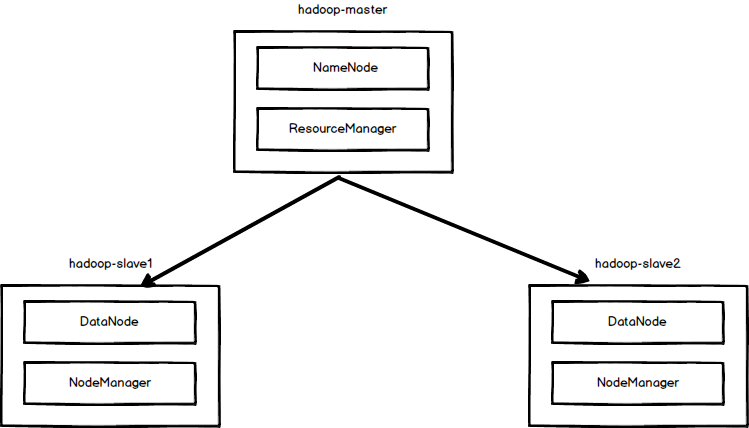

## Run Hadoop Cluster within Docker Containers




### 3 個節點的 Hadoop 叢集
##### 1. build image
```
./build-image.sh
```

##### 2. 建立 docker network
```
docker network create --driver=bridge hadoop
```

##### 3. 執行 container
```
./start-container.sh
```

##### output
```
start hadoop-master container...
start hadoop-slave1 container...
start hadoop-slave2 container...
root@hadoop-master:~#
```

##### 4. 啟動 Hadoop
```
./start-hadoop.sh
```

##### 5. 執行 wordcount
```
./run-wordcount.sh
```

##### output
```
input file1.txt:
Hello urAD

input file2.txt:
Hello Hadoop

input file3.txt:
Hello Docker

wordcount output:
Docker  1
Hadoop  1
Hello 3
urAD  1
```

### 任意大小的 Hadoop 叢集
##### 1. 重建 docker image
```
./resize-cluster.sh 5
```
* 指定參數 >1: 2, 3...
* 這個 script 會重建 hadoop image 裡的 slave node 的名稱

##### 2. 執行 container
```
./start-container.sh 5
```
* 指定參數 >1: 2, 3...

##### 3. 啟動 Hadoop
同上 4 ~ 5
